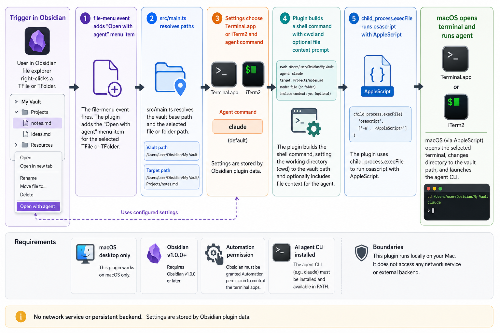

<div align="center">
  

  # Agents

  **🚀 Launch AI agents from your vault — right-click any file or folder to open a terminal with context 🤖**
</div>

Agents is a macOS-only Obsidian plugin that adds an **Open with agent** action to the file explorer context menu. Right-click a note or folder and it opens your configured AI CLI in Terminal.app or iTerm2, already pointed at the right vault location.

Files launch the agent from the parent folder with a short file-context prompt. Folders launch the agent directly in that folder.

## Install

From Obsidian, install **Agents** in **Settings -> Community Plugins -> Browse**, then enable it.

For local development:

```bash
git clone https://github.com/tsilva/obsidian-agents-plugin.git
cd obsidian-agents-plugin
pnpm install
pnpm run build
pnpm run install-plugin
```

Reload Obsidian, then right-click a file or folder in the file explorer and choose **Open with agent**.

## Commands

```bash
pnpm install             # install dependencies
pnpm run dev             # watch-build main.js during development
pnpm run build           # type-check and build the production plugin
pnpm run install-plugin  # build if needed, symlink into a vault, and enable the plugin
pnpm run version         # sync package version into manifest.json and versions.json
```

## Notes

- macOS desktop only. The plugin exits early on non-Darwin platforms.
- Obsidian v1.0.0 or newer is required by `manifest.json`.
- The default agent command is `claude`; settings can change it to another CLI such as `codex`.
- Terminal.app is the default terminal. The settings toggle switches launches to iTerm2.
- The first launch may require macOS Automation permission for Obsidian to control Terminal.app or iTerm2.
- `pnpm` is the expected package manager for this repo.
- The plugin runs locally through AppleScript and `osascript`; it does not use a backend service.

## Architecture



## License

[MIT](LICENSE)
